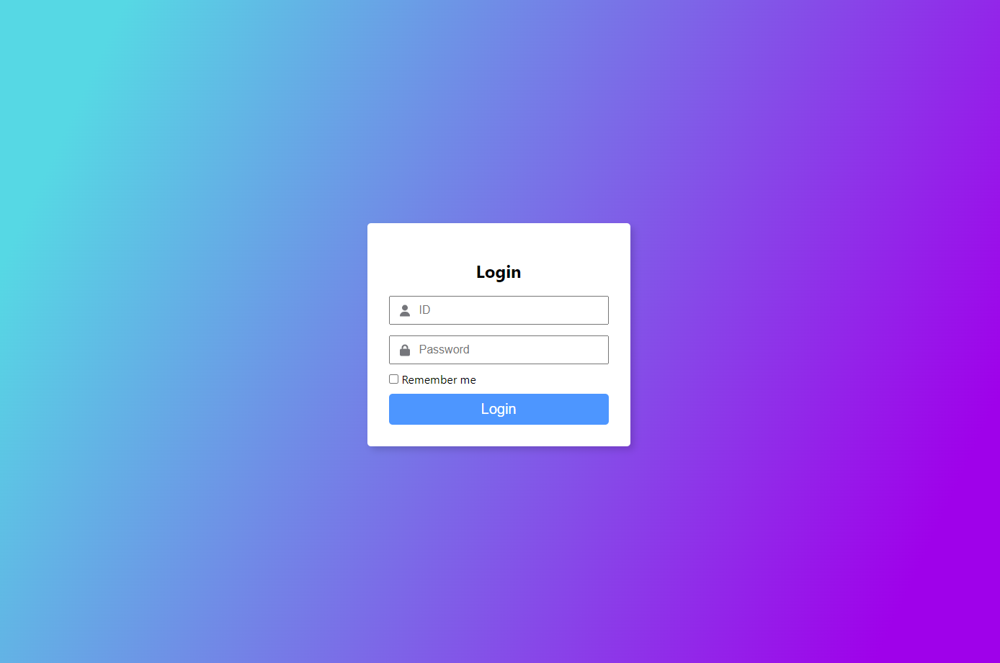
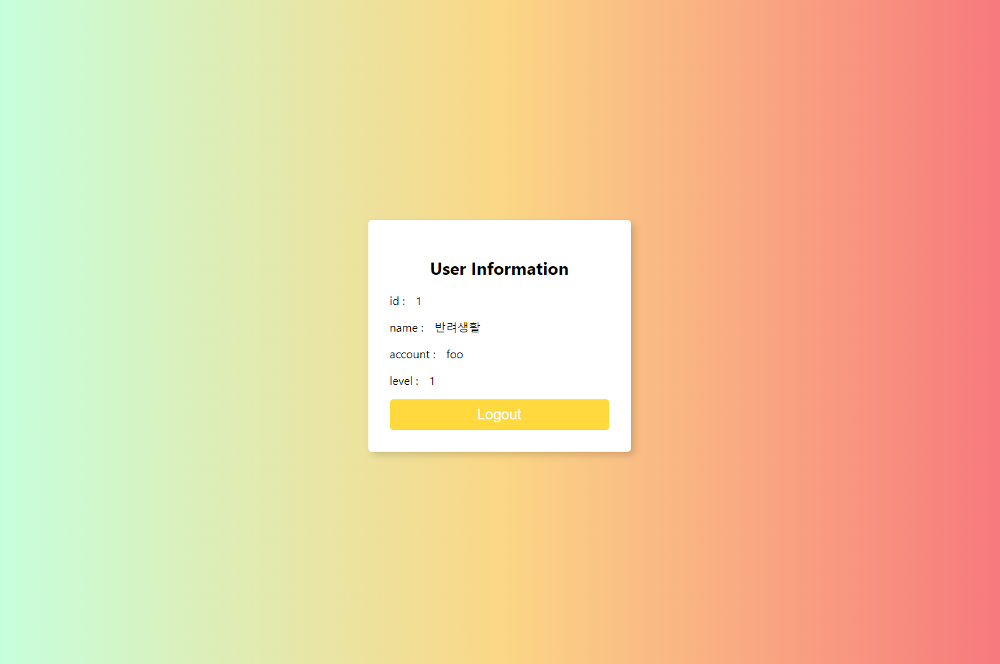

# react-login

## 목적
- react
- typescript
- emotion
- TDD
- API 인증
- 로그인 정보 유지

을 연습하기 위해 로그인을 구현해보는 프로젝트

*Thanks to* 개발바닥 [pilot-react](https://github.com/leejaycoke/pilot-react) 프로젝트

## 실행법
시작
> npm start

테스트
> npm test

서버 - https://github.com/leejaycoke/pilot-react 에서 다운받은 다음 docker로 빌드해서 실행한다.

## 배운 점 회고글
https://bluepebble25.tistory.com/38

## 결과

